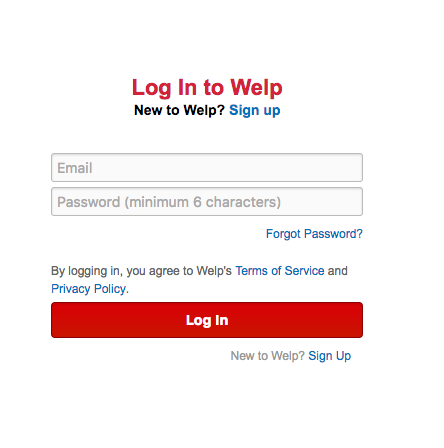
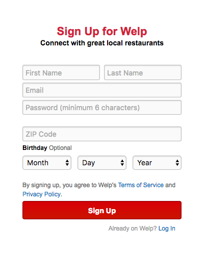
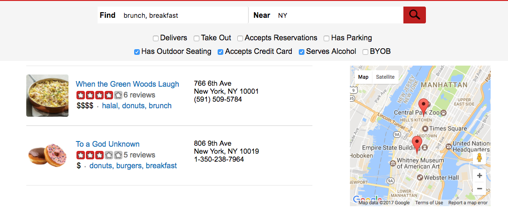
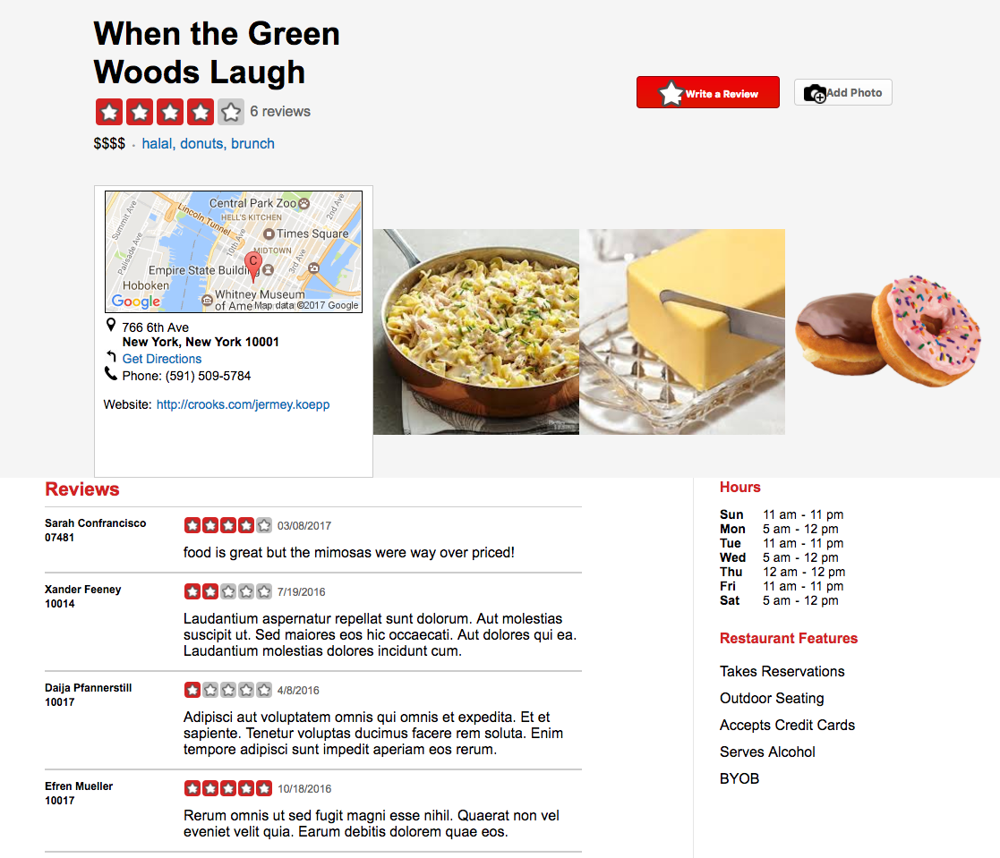
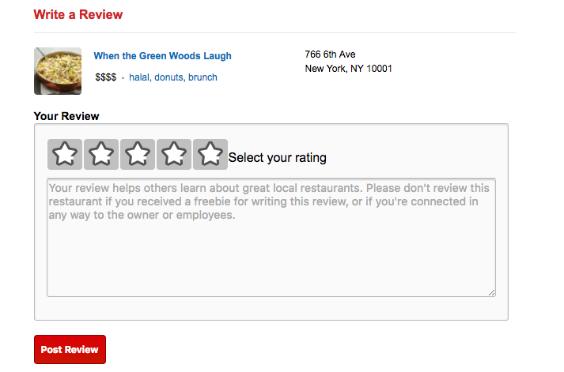

# README

Welp is a full-stack web application to search for, rate, and review restaurants based off the website Yelp. It uses a PostgreSQL database, a Ruby on Rails 4.2.7.1 MVC framework written in Ruby 2.3.1, React.js 15.4.2 with a Redux 3.6.0 architecture framework for rendered components written in ES6 JavaScript and CSS3 for styling. [Click here](wwww.welpthatsdinner.com) for the live website.  

## How to Use

### Download and Set Up
- Download the repo
- <tt>bundle install</tt>
- <tt>npm install</tt>
- <tt>bundle exec rake db:setup</tt>
- <tt>bundle exec rails server</tt>
- Go to your local host!

### Pages
#### Login
#### 
#### Sign Up
#### 
#### Search
#### 
#### Restaurant Show
#### 
#### Review Form
#### 


## Google Maps and Geocoder
When the user searches for restaurants they want to know where those restaurants are. I used the Google Maps Api to render the location of restaurants but to do this you need to know their longitude and latitude. Most users who want to add a restaurant don't know their business' latitude and longitude. Conversely users who want to go to a restaurant need an address not coordinates. I used a ruby gem, Geocoder, to take a restaurant's address and get its coordinates. When seeding my database it wasn't feasible to find 50+ valid NYC addresses around NYC so I used Geocoder to find real addresses for seed restaurants based on latitude and longitude. I picked a maximum and minimum longitude and latitude for NYC and gave each restaurant random coordinates in those ranges.


## High View Application Walkthrough

### Database
There are tables for users, restaurants, types (of food), a table to link restaurants and types; restaurant_types, and reviews. All were created using ActiveRecord and are stored in a Postgres 0.15 database.

```Ruby
create_table "reviews", force: :cascade do |t|
  t.integer  "user_id",       null: false
  t.integer  "restaurant_id", null: false
  t.text     "body",          null: false
  t.integer  "rating",        null: false
  t.string   "date",          null: false
  t.datetime "created_at",    null: false
  t.datetime "updated_at",    null: false
end

add_index "reviews", ["restaurant_id"], name: "index_reviews_on_restaurant_id", using: :btree
add_index "reviews", ["user_id", "restaurant_id"], name: "index_reviews_on_user_id_and_restaurant_id", unique: true, using: :btree
add_index "reviews", ["user_id"], name: "index_reviews_on_user_id", using: :btree
```

### Models
There are models for every table. Associations between models are established in ActiveRecord. Restaurants belong to users, reviews belong to a restaurant and a user, restaurant_types belong to a restaurant and a type. Most queries are done in ActiveRecord (finding the current user or all reviews for the current restaurant) but queries made by users are executed in pure SQL for speed. The user inputs strings for types and location so it is important to sanitize those inputs.

```Ruby
class Review < ActiveRecord::Base
  belongs_to :user
  belongs_to :restaurant
  after_initialize :create_date
  validates :user, :restaurant, :body, :date, :rating, presence: true
```
```Ruby
class Restaurant < ActiveRecord::Base
  def self.has_types_location_features(types, location, features)
    type_q_marks, type_names = sanitize_types(types)
    features = features.map { |feat| 'restaurants.' + feat + ' = true' }.join(" AND ")
    search = Restaurant.find_by_sql([<<-SQL, location, location, location, *type_names])
      SELECT
        restaurants.*
      FROM
        restaurants
        LEFT JOIN
          restaurant_types
          ON
          restaurant_types.restaurant_id = restaurants.id
        LEFT JOIN
          types
          ON
          types.id = restaurant_types.type_id
      WHERE
        (restaurants.city LIKE ? OR restaurants.state LIKE ? OR restaurants.zip LIKE ?)
        AND types.name IN (#{type_q_marks}) AND #{features}

    SQL

  end
```

### Controllers
The users and sessions controllers allow users to log in and log out. The reviews controller adds and edits reviews to the database, fetches all reviews for the current restaurant or the review corresponding to the current user and current restaurant. The restaurant controller can add new restaurants, find all the details for the restaurant corresponding to the id in the current url or query the Restaurant model for all restaurants that match a user search. All the controllers are children of the rails ActionController base.

```Ruby
class Api::ReviewsController < ApplicationController
def show
  @review = Review.find_by(id: params[:id]) || Review.find_by({user_id: params[:user_id], restaurant_id: params[:restaurant_id]}) || Review.new()
  @user = @review.user || {id: nil, fname: "", lname: "", zip: ""}
end
```

### Views
A RESTful naming convention makes it easy for rails to know what controller method to go to based on the route and url verb and what view to render given the controller method. The controllers and views are nested under an API namespace. All views deconstruct model instances fetched by the controllers into JSON using jBuilder 2.0 to match the frontend which is written in javascript. The current user is bootstrapped onto the window on the root page to allow users to remain logged in.

```Ruby
namespace :api, defaults: {format: :json} do
  resources :users, only: [:create]
  resource :session, only: [:create, :destroy]
  resources :restaurants, only: [:create, :show, :update, :index]
  resources :reviews, only: [:create, :show, :update, :index]
end
root "static_pages#root"

end
```

```Ruby
json.extract! @review, :id, :rating, :body, :date
json.set! :user do
  json.extract! @user, :id, :fname, :lname, :zip
end
```

### Actions, Reducers and the Store
jQuery's ajax function is used to fetch JSON from different views. The returned promise dispatches the JSON and the action it executed (fetchRestaurants, addReview, etc) to the root reducer through Thunk middleware. Based on the action the root reducer assigns the data to a different section of the store's state. The state has six sections: currentUser, errors, loading, restaurant, reviewIndex, and search.

```javascript
export const getReview = (user_id, restaurant_id, id = "id") => {
  return $.ajax({
    method: "GET",
    url: `/api/reviews/${id}`,
    data: {user_id, restaurant_id}
  });
}
```

```javascript


export const getReview = (user_id, restaurant_id) => dispatch => {

  return APIUtil.getReview(user_id, restaurant_id)
    .then((review) => dispatch(receiveReviews(review)),
    (err) => dispatch(receiveErrors(err.responseJSON)));
};

```

### Components
Components are what the user sees on the page. The Header, Error, and Footer components are rendered on every page. Different components have access to different sections of state. The currentUser is available to the Session, RestaurantShow, Search, and ReviewForm components. The restaurant state section is available to the RestaurantShow component, the reviewIndex state slice is available to the ReviewIndex and ReviewForm components, the search slice is available to the search component. These components also have children components. The application is a single page and uses React's hashHistory. What components are rendered to the page is determined by the route path after the # as assigned in root component. Components that need to fetch data to render (a restaurant show page needs to get the restaurants reviews) will dispatch an action to make an ajax call when the component has just mounted or is about to mount.

```javascript
class ReviewForm extends React.Component {

  componentDidMount(){
    this.props.showRestaurant(this.props.params.restaurantId);
    if(this.props.currentUser.id){
      this.props.getReview(this.props.currentUser.id, this.props.params.restaurantId);
    }
    else {
      this.props.router.push("/login");
    }
  }
}
```

##ToDos
* [ ] Allow users to upload photos with their reviews
* [ ] Create a splash homepage
* [ ] Allow users to add new restaurants
